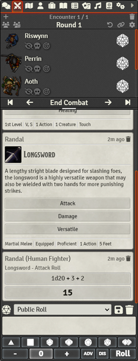

# Combat Chat

A simple Foundry VTT utility to display the chat log and form on the combat tracker tab.

# Features

- Display the chat log and combat tracker together on the combat tracker tab.
- Adjust the ratio of combat to chat by dragging the handle between the chat log and combat tracker.
- Each user can enable or disable the utility in the module's settings.

# Acknowledgements
This is an update of Oromis' original [Combat Focus](https://github.com/Oromis/foundry-combat-focus/) module. All thanks go to Oromis for developing this module in the first place.